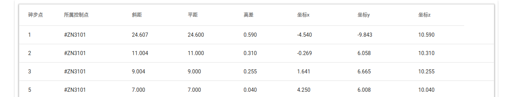
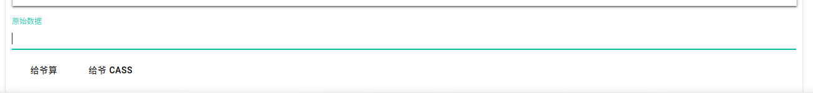
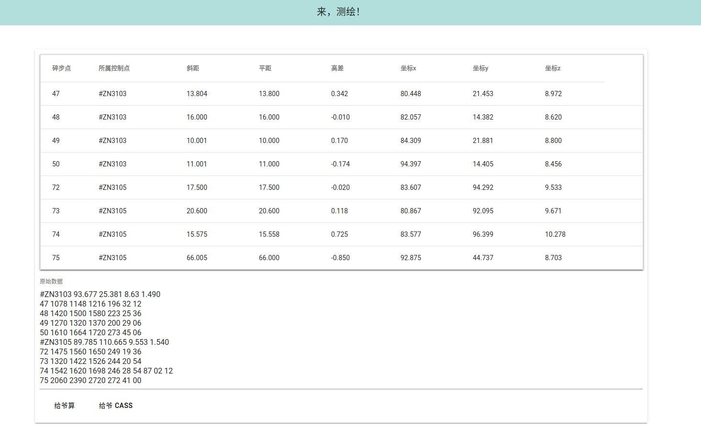
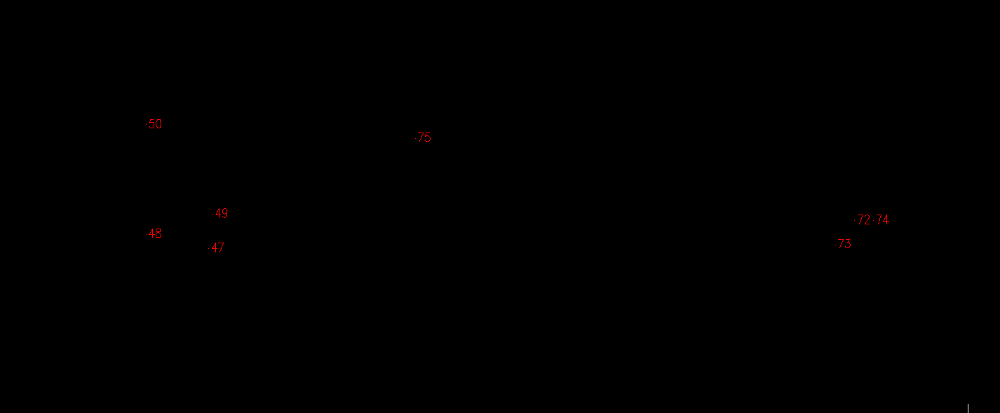

# opks-js

> 在这儿使用 https://opks.sakuya.love/

## 功能

### 1. 可以算出以下数据



### 2. 可以生产导入南方 CASS 成图所需的 DAT 文件

## 使用方法

1. 在文本编辑器（如记事本）中组织原始数据

2. 复制组织好的原始数据到 👇

   

3. 点击计算（可能需要点击两下）或获取 DAT 文件

## 原始数据格式

原始数据为纯文本，每个点一行，分为两种行

### 控制点行

```text
#ZN3101 10 10 10 1.444
```

如上，控制点行由 `#` 开头，有五个数据，被空格分开，依次为控制点名称、控制点 x 坐标，控制点 y 坐标、控制点 z 坐标、在该控制点测量碎步点时的仪器高。单位均为米。

上面所示例子，意为 `#ZN3101` 号控制点，x、y、z 坐标均为 10 米，仪器高为 1.444 米

控制点行之后紧跟在该点测量的若干个碎步点行

### 碎步点行

```text
21 1525 1425 1325 20 12 54 90 00 00
```

如上，不以 `#` 开头的行被认为是碎步点行，每行有 10 个数据，由空格分隔。

依次为 碎步点号、上丝读数、中丝读数、下丝读数、H盘度、H盘分、H盘秒、V盘度、V盘分、V盘秒

> NOTE!!!
>
> 如果安装测绘实习说明指导，此时的 H 盘读数，应该是控制点到被测碎步点的直线的方位角
>
> 在本程序中，将 H 盘读数视为方位角计算，如上例控制点到碎步点直线的方位角为 `20°12′54″`
>
> 故若未按要求测绘时，不可直接填入 H 盘读数，而是应该计算出控制点-碎步点方位角之后再组织数据


>NOTE!!!
>
>如果 V 盘读数为 `90°00′00″` 时可以省略，即上行可以记作
>
>```text
>21 1525 1425 1325 20 12 54
>```
>
>


## 样例

### 原始数据

```text
#ZN3103 93.677 25.381 8.63 1.490
47 1078 1148 1216 196 32 12
48 1420 1500 1580 223 25 36
49 1270 1320 1370 200 29 06
50 1610 1664 1720 273 45 06
#ZN3105 89.785 110.665 9.553 1.540
72 1475 1560 1650 249 19 36
73 1320 1422 1526 244 20 54
74 1542 1620 1698 246 28 54 87 02 12
75 2060 2390 2720 272 41 00
```

上述样例中有两个控制点 `#ZN3103` 和 `#ZN3105`，其中在 `#ZN3103` 处测量了 `47` 、`48` 、`49` 和 `50` 号碎步点。

其中第 `74` 号碎步点， V 盘读数为 `87°02′12″`，其余为 `90°00′00″` 故省略。

### 计算效果



### 导入南方 CASS

点击 `给👴 CASS` 下载 CASS 所需的 `cass.dat` 文件之后，导入南方 CASS 如图👇

